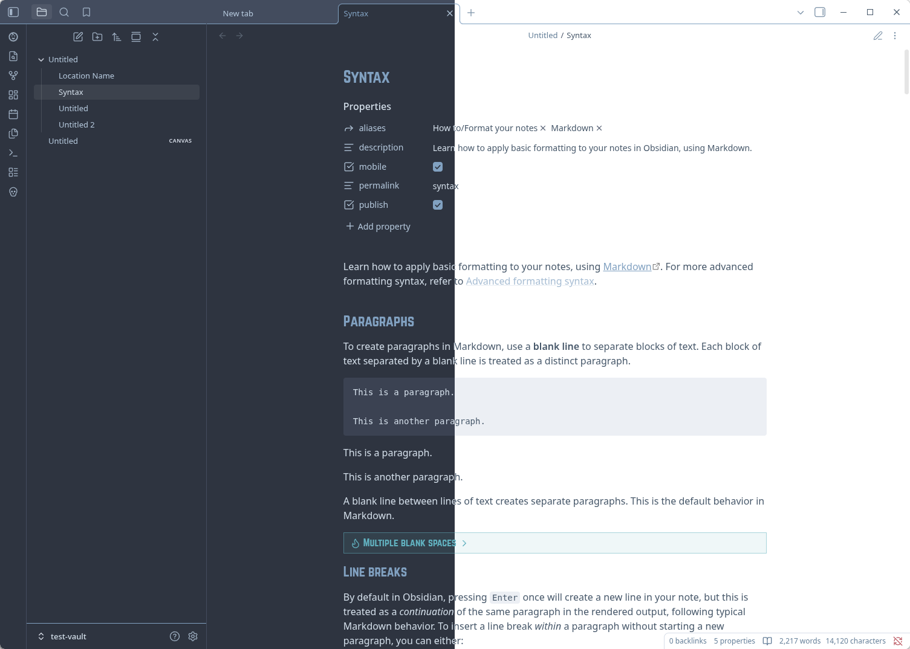
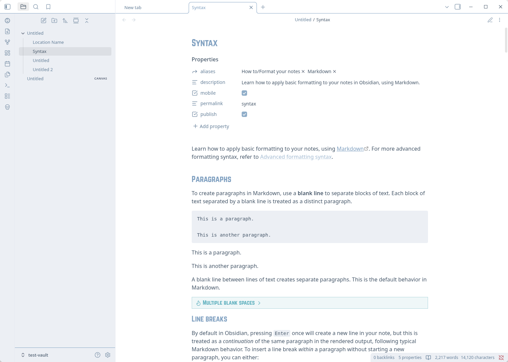
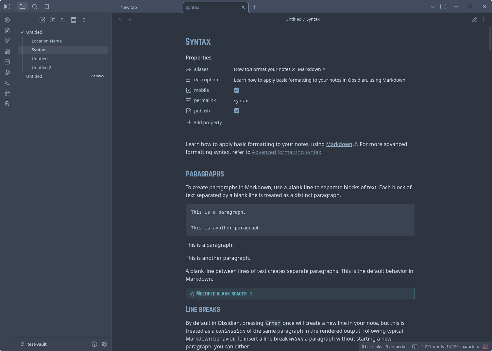
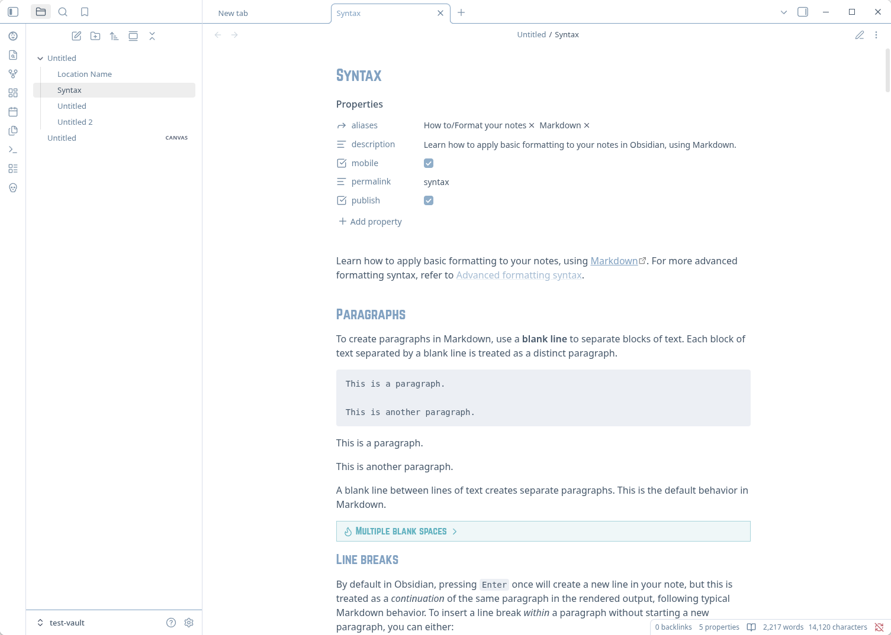
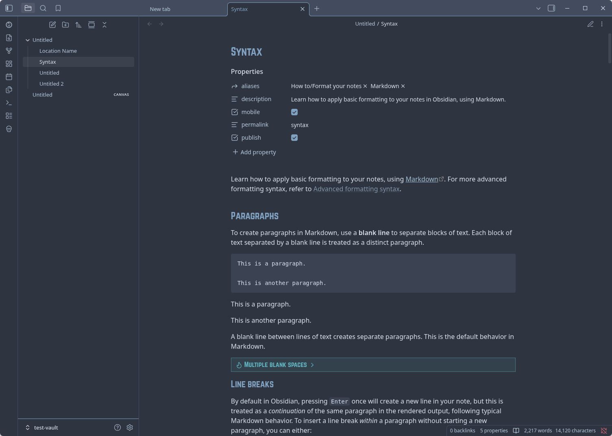

# Nordic for Obsidian
> A theme for obsidian inspired by https://www.nordtheme.com/ with a pinch of person preference

---

## Flavors

### Base
|      Light         |         Dark       |
|---------------------|---------------------|
|  |  |

### Uniform
|      Light         |         Dark       |
|---------------------|---------------------|
|  |  |

## Plugins
> This is a list of all the plugins the theme currently explicitly supports
- [Fantasy Statblocks](https://github.com/javalent/fantasy-statblocks)
- [Styled Settings]()

## Installation

### Obsidian
- Goto settings
- Click appearances tab
- Next to themes click manage
- Search for `Nordic` and select it
- Click `Use this theme`, you are done :)

## Credits
- [Norwester font by James Wilson](https://jamiewilson.io/norwester/)
- [Nord Theme](https://www.nordtheme.com/): for the amazing palette 
- [Obsidian Nord](https://github.com/insanum/obsidian_nord): for the initial inspiration
- [Discord Nordic](https://github.com/orblazer/discord-nordic): for the initial inspiration
