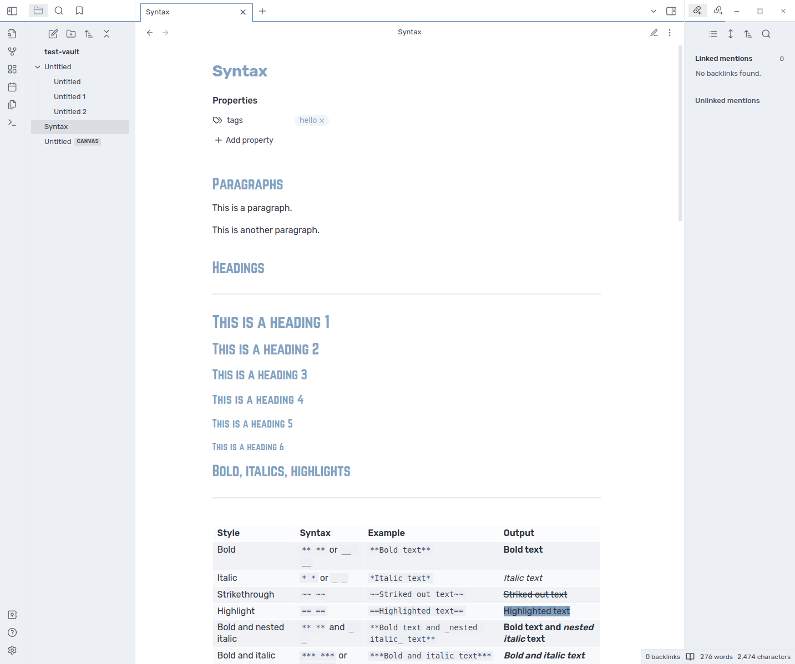

# Nordic for Obsidian
> A theme for obsidian inspired by https://www.nordtheme.com/ with a pinch of person preference

---

## Flavors

### Default
|      Light         |         Dark       |
|---------------------|---------------------|
|  |  |

### Uniform
|      Light         |         Dark       |
|---------------------|---------------------|
|  |  |

## Plugins
> This is a list of all the plugins the theme currently explicitly supports

- [Fantasy Statblocks](https://github.com/javalent/fantasy-statblocks)

## Credits
- [Manrope font](https://fonts.google.com/specimen/Manrope)
- [Norwester font by James Wilson](https://jamiewilson.io/norwester/)
- [Nord Theme](https://www.nordtheme.com/): for the amazing palette 
- [Obsidian Nord](https://github.com/insanum/obsidian_nord): for the initial inspiration
